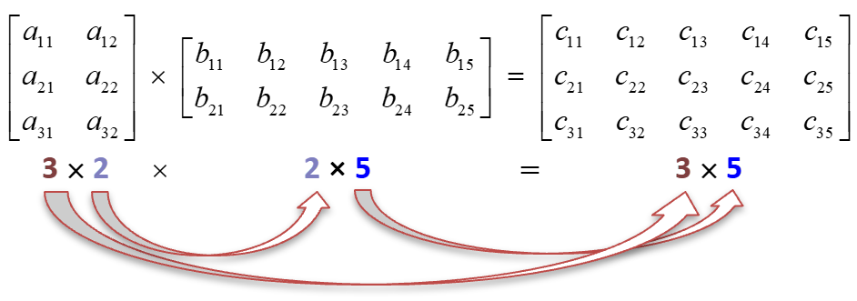

# Matrices
  
## A c++ implementation of a matrix object that holds integers as well as matrix operations.
## 📌 What is a Matrix
A matrix is a rectangular array of items represented using columns and rows..  
### An example of a matrix is as follows:  
 1 2 3  
 4 5 6  
 7 8 9  

## 🎇 Core Mechanism and Approach
For simplication, this implementation of matrices is mainly concerned with matrices of a size of 3x3. 
The items being stored in the matrices are integers and are manually inputed into the matrix by the user.  

## ✨ Class Methods and Key Features 
Each Matrix class/object has the following methods for the user to interact with:  

*Matrix(int,int)*: A constructor to initialise the dimensions of the matrix as well as the 2d point to hold the items in the matric.    
*Matrix(Matrix &)*: A copy constructor that makes a shallow copy of another matrix.    
*~Matrix*: The destructor deallocates all memory used up by the object.    
*insertVal(int,int,int)*: inserts a value into the matrix at the specified index.    
*getRowNumber()* : Returns the number of rows in the matrix.    
*getColumnNumber()* : Returns the number of columns in the matrix.    
*getMatrix()* : Returns the 2D pointer array of the matrix..    
*operator+(Matrix &)const*:Overloads the addition operator so that we can add two matrices as follows: C = A + B    
*operator-(Matrix &)const*:Overloads the subtraction operator so that we can subtract two matrices as follows: C = A - B    
*operator*(Matrix &)const*:Overloads the multiplication operator so that we can multiply to matrices as follows: C = A * B    
*calcIdentityMatrix()*: Returns the identity Matrix.    
*transposeMatrix()*: Returns the transpose of a matrix   
*calcDeterminant()*: Calculates the determinant of a matrix.    
*DisplayMatrix()*:Displays the matrix\.   
*isInvertible()*: Checks if the matrix is invertible.    
*isTriangular()*: Checks if the matrix is triangular.    
*LinearEquationRep*: Represents the Matrix as a system of linear equations..    

## 🔦 Known issues
The following features are still in progress:  
*operator*(Matrix &)const*   
*calcIdentityMatrix()*:   
*transposeMatrix()*:    
*calcDeterminant()*:   
*DisplayMatrix()*:   
*isInvertible()*:    
*isTriangular()*:    
*LinearEquationRep*:    

     

